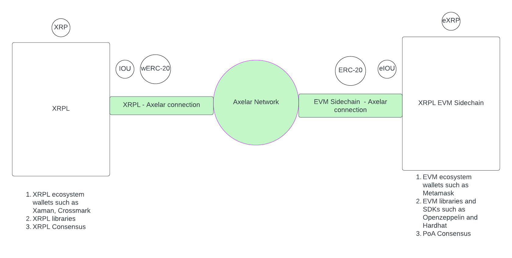

# Cross-Chain DApps on XRPL

The Web3 landscape and dApp development is increasingly becoming cross-chain. With the rise of various blockchain technologies, developers need access to multiple chains to leverage their strengths. This is where interoperability infrastructure plays a key role, connecting blockchains and enabling developers to work across them.

On its own, the XRP Ledger boasts great features, such as:

- A native DEX.
- Low transactions fees.
- Fast confirmation times.

However developers may find these benefits aren't enough for their dApp needs. Two common pain points are smart contracts and access to liquidity on other blockchains.

## Smart Contracts

The XRP Ledger doesn't support general purpose smart contracts, but the [EVM compatible XRPL sidechain](../evm-sidechain/intro-to-evm-sidechain.md) does. There are two methods of interacting with the EVM sidechain:

1. Directly execute smart contracts on the EVM sidechain, and bridge assets through the XRPL bridge when necessary. See: [Get Started with the EVM Sidechain](../evm-sidechain/get-started-evm-sidechain.md)
2. Use the Axelar network's GMP functionality to execute a smart contract directly from  the XRPL. See: [Call a Smart Contract Function](../axelar/call-a-smart-contract-function.md)

## Liquidity Access

The XRP Ledger is now integrated with the Axelar network, giving it access to the functionality and liquidity of any chain connected to Axelar. Moving XRP and tokens to and from the XRPL has never been easier. To learn how quickly assets can be bridged, see: [Bridge Tokens Between Ethereum and XRPL](../axelar/bridge-tokens-axelar.md).    